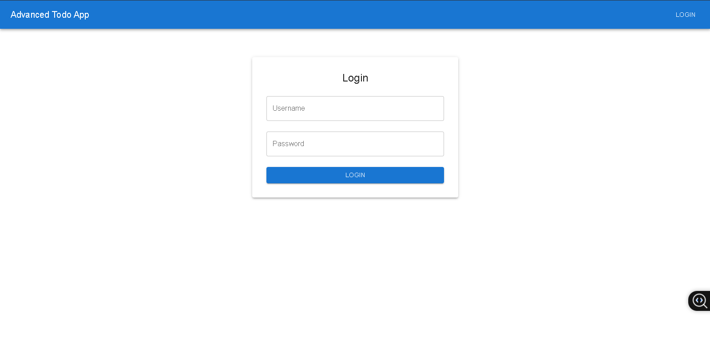

# Advanced Todo App  
(./screenshot-1.png) 

## Features  
- ✅ Add/delete tasks with priority levels  
- 🌦️ Real-time weather for tasks with locations  
- 📱 Fully responsive (mobile + desktop)  
- 🔐 Mock authentication flow  

## Demo  
[Live on Netlify](https://advancedtodolistayush.netlify.app/)  

## Setup  
1. Clone repo  
2. `npm install`  
3. Create `.env.local` with: REACT_APP_WHEATHER_API_KEY=your_key
4. `npm start`  

## Known Issues  
- Weather API occasionally times out (would add retry logic in future).  
## Future Features  
- Drag-and-drop reordering  
- User accounts with Firebase 